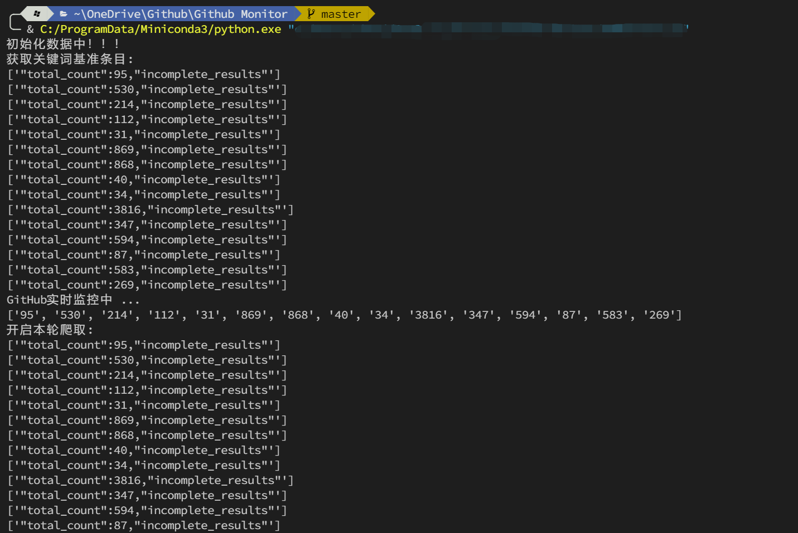
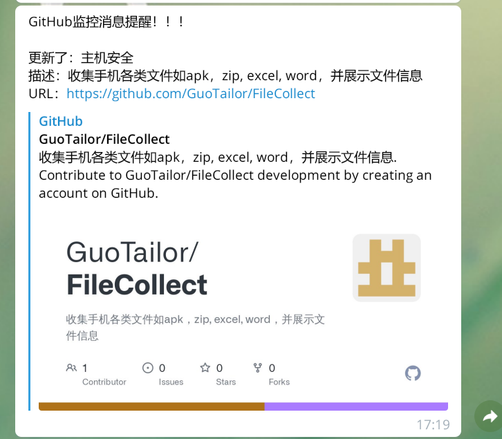

# Github Monitor

## 功能

监控Github上的关键词更新情况，并推送钉钉、邮箱、TGBot、Server酱。

依赖库见：`requirements`文件

## 截图

运行截图：

tg推送截图：

## 参考

[CVEAP](https://github.com/JustYoomoon/CVEAP)

[github-cve-monitor](https://github.com/yhy0/github-cve-monitor)

